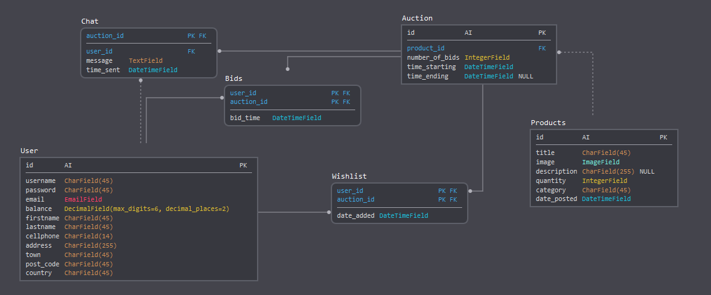

The Model Layer
+++++++++++++++

Introduction to models
----------------------

By default, the configuration uses SQLite. If you’re new to databases, or you’re just interested in trying Django, this is the easiest choice. SQLite is included in Python, so you won’t need to install anything else to support your database. 

Field types
-----------

* ``CharField`` : A string field for small strings. Also it requires the maximum length of the string as an argument.
 
 **Field.choices** : An iterable (e.g., a list or tuple) consisting itself of iterables of exactly two items (e.g. [(A, B), (A, B) ...]) to use as choices for this field.
 
 The first element in each tuple is the actual value to be set on the model, and the second element is the human-readable name. For example: ::
  CATEGORIES = (
    ('LAP', 'Laptop'),
    ('CON', 'Console'),
    ('GAD', 'Gadget'),
    ('GAM', 'Game'),
    ('TEL', 'TV'))

* ``DateTimeField`` : A date and time, represented in Python.
* ``IntegerField`` : An integer. Values from -2147483648 to 2147483647 are safe in all databases supported by Django.
* ``DecimalField`` : A fixed-precision decimal number, represented in Python by a Decimal instance. Has two required arguments

 **DecimalField.max_digits** : The maximum number of digits allowed in the number. Note that this number must be greater than or equal to decimal_places.

 **DecimalField.decimal_places** : The number of decimal places to store with the number.

* ``EmailField`` : A CharField that checks that the value is a valid email address. It uses EmailValidator to validate the input.
* ``ImageField`` : Inherits all attributes and methods from FileField, but also validates that the uploaded object is a valid image.
* ``TextField`` : A large text field.

For more field types check the official documentation `here <https://docs.djangoproject.com/en/2.0/ref/models/fields/#django.db.models.DateField/>`_.

Indexes
-------

* ``PrimaryKey`` : In django an id field is added automatically acting as a primary key. Of course his behavior can be overridden.
* ``ForeignKey`` : To define a many-to-one relationship, use **django.db.models.ForeignKey**. You use it just like any other Field type: by including it as a class attribute of your model.

Building our own models
-----------------------

The ``models.py`` file must look like this : ::

 from django.db import models

 # Create your models here.
 class User(models.Model):
 	username = models.CharField(max_length=45)
 	password = models.CharField(max_length=45)
 	email = models.EmailField()
	balance = models.DecimalField(max_digits=6, decimal_places=2)
	firstname = models.CharField(max_length=56)
	lastname = models.CharField(max_length=45)
	cellphone = models.CharField(max_length=14)
	address = models.CharField(max_length=255)
	town = models.CharField(max_length=45)
	post_code = models.CharField(max_length=45)
	country = models.CharField(max_length=45)

 class Product(models.Model):
	CATEGORIES = (
            ('LAP', 'Laptop'),
            ('CON', 'Console'),
            ('GAD', 'Gadget'),
            ('GAM', 'Game'),
            ('TEL', 'TV')
        )
	
	title = models.CharField(max_length=255)
	image = models.ImageField()
	description = models.CharField(max_length = 500)
	quantity = models.IntegerField()
	category = models.CharField(
            max_length=2,
            choices=CATEGORIES
        )
	date_posted = models.DateTimeField(auto_now_add=True, blank=True)

 class Auction(models.Model):
	product_id = models.ForeignKey(Product, on_delete=models.CASCADE)
	number_of_bids = models.IntegerField()
	time_starting = models.DateTimeField()
	time_ending = models.DateTimeField()

 class Watchlist(models.Model):
	user_id = models.ForeignKey(User, on_delete=models.CASCADE)
	auction_id = models.ForeignKey(Auction, on_delete=models.CASCADE)

 class Bid(models.Model):
	user_id = models.ForeignKey(User, on_delete=models.CASCADE)
	auction_id = models.ForeignKey(Auction, on_delete=models.CASCADE)
	bid_time = models.DateTimeField()

 class Chat(models.Model):
	auction_id = models.ForeignKey(Auction, on_delete=models.CASCADE)
	user_id = models.ForeignKey(User, on_delete=models.CASCADE)
	message = models.TextField()
	time_sent = models.DateTimeField()

Adding our models to the database
---------------------------------

Now that we've written our models we have to migrate them into our database.
We can achive this by running the following commands: ::
 >> python manage.py makemigrations website

You should see something similar to the following: ::

  Migrations for 'website':
  website\migrations\0001_initial.py
    - Create model Auction
    - Create model Bid
    - Create model Chat
    - Create model Product
    - Create model User
    - Create model Watchlist
    - Add field user_id to chat
    - Add field user_id to bid
    - Add field product_id to auction

By running makemigrations, you’re telling Django that you’ve made some changes 
to your models (in this case, you’ve made new ones) and that you’d like the 
changes to be stored as a migration. Migrations are how Django stores changes 
to your models (and thus your database schema) - they’re just files on disk. 
You can read the migration for your new model if you like it’s the file 
website/migrations/0001_initial.py.

There’s a command that will run the migrations for you and manage your database 
schema automatically - that’s called migrate, and we’ll come to it in a moment - 
but first, let’s see what SQL that migration would run. The sqlmigrate command 
takes migration names and returns their SQL: ::

 >> python manage.py sqlmigrate website 0001

You should see something similar to the following: ::
    
    BEGIN;
    --
    -- Create model Auction
    --
    CREATE TABLE "website_auction" ("id" integer NOT NULL PRIMARY KEY AUTOINCREMENT, "number_o
    f_bids" integer NOT NULL, "time_starting" datetime NOT NULL, "time_ending" datetime NOT NU
    LL);
    --
    -- Create model Bid
    --
    CREATE TABLE "website_bid" ("id" integer NOT NULL PRIMARY KEY AUTOINCREMENT, "bid_time" da
    tetime NOT NULL, "auction_id_id" integer NOT NULL REFERENCES "website_auction" ("id") DEFE
    RRABLE INITIALLY DEFERRED);
    --
    -- Create model Chat
    --
    CREATE TABLE "website_chat" ("id" integer NOT NULL PRIMARY KEY AUTOINCREMENT, "message" te
    xt NOT NULL, "time_sent" datetime NOT NULL, "auction_id_id" integer NOT NULL REFERENCES "w
    ebsite_auction" ("id") DEFERRABLE INITIALLY DEFERRED);
    --
    -- Create model Product
    --
    CREATE TABLE "website_product" ("id" integer NOT NULL PRIMARY KEY AUTOINCREMENT, "title" v
    archar(255) NOT NULL, "image" varchar(100) NOT NULL, "description" varchar(500) NOT NULL,
    "quantity" integer NOT NULL, "category" varchar(2) NOT NULL, "date_posted" datetime NOT NU
    LL);
    --
    -- Create model User
    --
    CREATE TABLE "website_user" ("id" integer NOT NULL PRIMARY KEY AUTOINCREMENT, "username" v
    archar(45) NOT NULL, "password" varchar(45) NOT NULL, "email" varchar(254) NOT NULL, "bala
    nce" decimal NOT NULL, "firstname" varchar(56) NOT NULL, "lastname" varchar(45) NOT NULL,
    "cellphone" varchar(14) NOT NULL, "address" varchar(255) NOT NULL, "town" varchar(45) NOT
    NULL, "post_code" varchar(45) NOT NULL, "country" varchar(45) NOT NULL);
    --
    -- Create model Watchlist
    --
    CREATE TABLE "website_watchlist" ("id" integer NOT NULL PRIMARY KEY AUTOINCREMENT, "auctio
    n_id_id" integer NOT NULL REFERENCES "website_auction" ("id") DEFERRABLE INITIALLY DEFERRE
    D, "user_id_id" integer NOT NULL REFERENCES "website_user" ("id") DEFERRABLE INITIALLY DEF
    ERRED);
    --
    -- Add field user_id to chat
    --
    ALTER TABLE "website_chat" RENAME TO "website_chat__old";
    CREATE TABLE "website_chat" ("id" integer NOT NULL PRIMARY KEY AUTOINCREMENT, "message" te
    xt NOT NULL, "time_sent" datetime NOT NULL, "auction_id_id" integer NOT NULL REFERENCES "w
    ebsite_auction" ("id") DEFERRABLE INITIALLY DEFERRED, "user_id_id" integer NOT NULL REFERE
    NCES "website_user" ("id") DEFERRABLE INITIALLY DEFERRED);
    INSERT INTO "website_chat" ("id", "message", "time_sent", "auction_id_id", "user_id_id") S
    ELECT "id", "message", "time_sent", "auction_id_id", NULL FROM "website_chat__old";
    DROP TABLE "website_chat__old";
    CREATE INDEX "website_bid_auction_id_id_8a24134d" ON "website_bid" ("auction_id_id");
    CREATE INDEX "website_watchlist_auction_id_id_1ce8deb1" ON "website_watchlist" ("auction_i
    d_id");
    CREATE INDEX "website_watchlist_user_id_id_517566fa" ON "website_watchlist" ("user_id_id")
    ;
    CREATE INDEX "website_chat_auction_id_id_17d789bb" ON "website_chat" ("auction_id_id");
    CREATE INDEX "website_chat_user_id_id_66161742" ON "website_chat" ("user_id_id");
    --
    -- Add field user_id to bid
    --
    ALTER TABLE "website_bid" RENAME TO "website_bid__old";
    CREATE TABLE "website_bid" ("id" integer NOT NULL PRIMARY KEY AUTOINCREMENT, "bid_time" da
    tetime NOT NULL, "auction_id_id" integer NOT NULL REFERENCES "website_auction" ("id") DEFE
    RRABLE INITIALLY DEFERRED, "user_id_id" integer NOT NULL REFERENCES "website_user" ("id")
    DEFERRABLE INITIALLY DEFERRED);
    INSERT INTO "website_bid" ("id", "bid_time", "auction_id_id", "user_id_id") SELECT "id", "
    bid_time", "auction_id_id", NULL FROM "website_bid__old";
    DROP TABLE "website_bid__old";
    CREATE INDEX "website_bid_auction_id_id_8a24134d" ON "website_bid" ("auction_id_id");
    CREATE INDEX "website_bid_user_id_id_7cc0c150" ON "website_bid" ("user_id_id");
    --
    -- Add field product_id to auction
    --
    ALTER TABLE "website_auction" RENAME TO "website_auction__old";
    CREATE TABLE "website_auction" ("id" integer NOT NULL PRIMARY KEY AUTOINCREMENT, "number_o
    f_bids" integer NOT NULL, "time_starting" datetime NOT NULL, "time_ending" datetime NOT NU
    LL, "product_id_id" integer NOT NULL REFERENCES "website_product" ("id") DEFERRABLE INITIA
    LLY DEFERRED);
    INSERT INTO "website_auction" ("id", "number_of_bids", "time_starting", "time_ending", "pr
    oduct_id_id") SELECT "id", "number_of_bids", "time_starting", "time_ending", NULL FROM "we
    bsite_auction__old";
    DROP TABLE "website_auction__old";
    CREATE INDEX "website_auction_product_id_id_b4d0e759" ON "website_auction" ("product_id_id
    ");
    COMMIT;

Now, run migrate again to create those model tables in your database: ::
 
 >> python manage.py migrate

we should see the following: ::
 Operations to perform:
  Apply all migrations: admin, auth, contenttypes, sessions, website
 Running migrations:
  Applying contenttypes.0001_initial... OK
  Applying auth.0001_initial... OK
  Applying admin.0001_initial... OK
  Applying admin.0002_logentry_remove_auto_add... OK
  Applying contenttypes.0002_remove_content_type_name... OK
  Applying auth.0002_alter_permission_name_max_length... OK
  Applying auth.0003_alter_user_email_max_length... OK
  Applying auth.0004_alter_user_username_opts... OK
  Applying auth.0005_alter_user_last_login_null... OK
  Applying auth.0006_require_contenttypes_0002... OK
  Applying auth.0007_alter_validators_add_error_messages... OK
  Applying auth.0008_alter_user_username_max_length... OK
  Applying auth.0009_alter_user_last_name_max_length... OK
  Applying sessions.0001_initial... OK
  Applying website.0001_initial... OK

The migrate command takes all the migrations that haven’t been applied 
(Django tracks which ones are applied using a special table in your database 
called django_migrations) and runs them against your database - essentially, 
synchronizing the changes you made to your models with the schema in the database.

Shell
-----

Now, we can use an interactive Python shell that API Django gives you. 
To invoke the Python shell, use this command: ::

 >> $ python manage.py shell

We should see the following text: ::

 Python 3.6.4 (v3.6.4:d48eceb, Dec 19 2017, 06:04:45) [MSC v.1900 32 bit (Intel)] on win32
 Type "help", "copyright", "credits" or "license" for more information.
 (InteractiveConsole)
 >>>
 
Using the shell we will create a new user for our website. Running the following commands: ::

 >>> from website.models import User
 >>> # Creates an User object.
 >>> user1 = User()
 >>> user1.username = "dummy1"
 >>> user1.email = "dummy1@mail.com"
 >>> user1.password = "dummypassword"
 >>> user1.balance = 20.0
 >>> user1.firstname = "Dummy"
 >>> user1.lastname = "One"
 >>> user1.cellphone = "6988757575"
 >>> user1.address = "Dumadd 199"
 >>> user1.town = "Dummtown"
 >>> user1.post_code = "35100"
 >>> user1.country = "Dummcon"
 >>> # Saves User object to the database.
 >>> user1.save()

If we want to check if the user was successfully registered we execute this command: ::

 >>> User.objects.all()
 <QuerySet [<User: User object (1)>]>

The result we get is quite unclear. Lets fix it by opening the models.py file and adding a **__str__()** method to User class ::

 class User(models.Model):
    ...
    
    def __str__(self):
        return "(" + self.username + ", " + self.email + ")"

Now lets execute again the previous command: ::

 >>> User.objects.all()
 <QuerySet [<User: (dummy1, dummy1@mail.com)>]>

The **User.objects.all()** is displaying all the User records in 
the database showing the username and the email of each user.

Retrieving specific objects with filters
---------

The QuerySet returned by *all()* describes all objects in the database table. 
Usually, though, you’ll need to select only a subset of the complete set of objects.
To create such a subset, you refine the initial QuerySet, adding filter conditions.

One way to do this is with the:

* filter(**kwargs)
    Returns a new QuerySet containing objects that match the given lookup parameters.

for example if we want to find the user with 'dummy1@mail.com' we will use: ::
 
 >>> User.objects.filter(email='dummy1@mail.com')
 <QuerySet [<User: ID:1 dummy1 dummy1@mail.com>]>
 
One more thing we will need from the QuerySet API are the field lookups. 
Field lookups are how you specify the meat of an SQL WHERE clause. 
They’re specified as keyword arguments to the QuerySet methods

for example if we want to find users with id greater than 5 we will use the
*gt* field lookup : ::
 
 >>>User.objects.filter(id__gt=5)
 <QuerySet []>
 
Some usefull field lookups are:

* ``gt`` : Greater than.

* ``lt`` : Less than

* ``gte`` : Greater than or equal to.

* ``lte`` : Less than or equal to.
